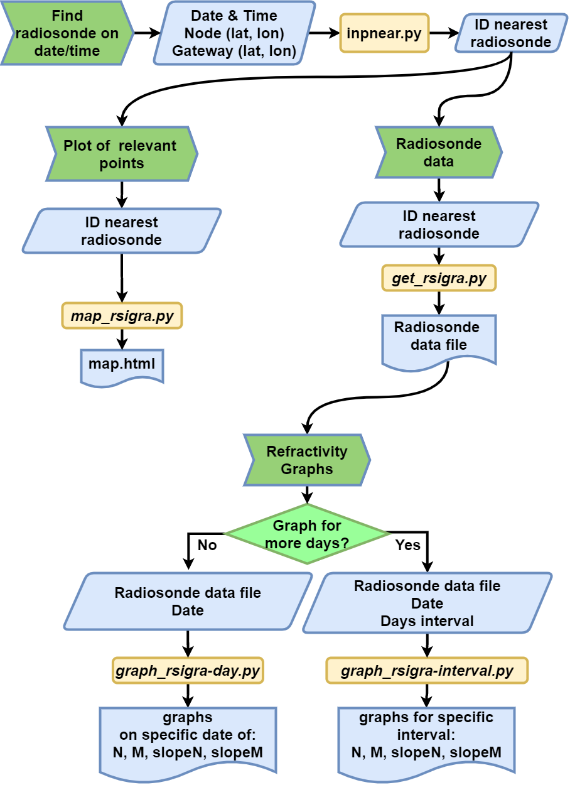

# Summary

Propagation beyond the horizon is a well known field of research which
has been used to establish long communication links since WW II.
Oftentimes people have experienced abnormal reception of FM radio
channels or TV broadcasts, especially in the summer. Nowadays, with the
exponential growth of Internet of Things (IoT) networks, many users have
documented very long links on the ISM bands (868 MHz in Europe) used by
such devices. It is worth noting that beyond the horizon transmission is
also a source of interference to other users, which might be unaware of
the origin of the spurious signals [@imam2009prediction]. Shedding light on the
anomalous propagation mechanism is a first and important step in the
mitigation efforts.

In a previous study [@zennaro2020troppo], we focussed on the use of the crowd
sourced initiative TheThingsNetwork (TTN), since it allowed leveraging
the openness of that system and the great number of TTN gateways
deployed globally, to check the reach of a simple IoT node that we have
installed on the roof of our institute.

Presently, we generalyze the analysis to cover any wireless link for
which the transmitter and receiver sites are specified, as well as the
date on which the very long distance link was observed.

Anomalous tropospheric propagation is defined [@itu1990effects] as a transmission
that extends beyond the geographical horizon. Normally, in those areas,
signals start to rapidly reduce in strength. Viewers living in such a
"deep fringe" reception area will notice that during certain
conditions, weak signals, normally masked by noise, increase its
strength to the point of allowing normal reception. Furthermore, in
special conditions related to the state of the troposphere at a given
time along the trajectory, the signals can reach very long distances
[ko1983anomalous]. Tropospheric propagated waves travel in the part
of the atmosphere adjacent to the surface and extending to some 12000 m.
Such signals are thus directly affected by weather conditions extending
over hundreds of kilometers.

Even if the maximum transmitted power of 14 dBm in LPWAN networks in
Europe is much lower than that of FM transmissions, the
advantage in terms of receiver sensitivity of both LoRa (thanks to the
processing gain offered by spread spectrum modulation) and Sigfox
(thanks to the ultra narrowband employed), explains why such long
distance paths can be spanned, if the anomalous propagation conditions
exist.

In this paper we present a set of software tools that allow the analysis
of any radio link making use of the publicly available IGRA (Integrated
Global Radiosonde Archive) database [@IGRA] of metereological
radiosondes that are periodically launched all over the globe.

These tools facilitate the analysis of beyond the horizon propagation by
automating the process of identifying the nearest radiosonde launch site
to any pair of points at a specific date.

The data from the identified radiosonde are then used to graph the
refractivity gradient versus height, the information needed to assess
the possible presence of the conditions for the existence of
super-refraction (which can extend the propagation moderately beyond the
line of sight) or tropospheric ducts, which can explain transmissions
over distances of thousands of kilometers.
\autoref{fig:duct} depicts the
latter case, which is more frequent in paths over seawater, since it is
a very good reflector.

# Python tools

We built a series of software tools to analyze anomalous tropospheric
propagation links. They are available on Github under an MIT License
and also as a Jupyter Notebook hosted by Google Colab as shown in
\autoref{fig:jupyter}. Sharing
the code using Google Colab facilitates the usage of these tools for
researchers, practitioners, or anyone interested, by removing the
installation requirements (Colab runs in a browser). While the complete
set of tools include more than 20 separate pieces of code (to parse data
from online databases and find long links, to gather data from TTN,
etc), in this paper we will focus on the tools that are part of the
workflow shown in \autoref{fig:workflow}. All the code is compatible with Python 3 and
runs on Windows, OSX and Linux devices.

Following is a description of the workflow to analyze a specific link.

1.  the user launches the *ipnear.py* script. Then enters the
    geographical coordinates of the two extremes of the link, the
    transmitter and the receiver, or the node and the gateway using 
    LPWAN's naming convention. Next the date and time when the link has
    been documented must be supplied. The output is the name of the
    radiosonde closest to the mid point between the two ends which has
    measurements available for the specific date. To determine its
    location we use the IGRA database, which contains radiosonde and
    pilot balloon observations from over 2700 globally distributed
    stations.

2.  to visualize the location of the radiosonde, launch the script
    called *map-rsigra.py*. This will produce a map similar to the one
    shown in \autoref{fig:Munich-map}. This is not a mandatory step in the
    workflow, but gives an idea of where the nearest radiosonde is
    located.

3.  now that the closest radiosonde has been determined, data for the
    specific date and time has to be downloaded from IGRA. This is done
    using the *get-rsigra.py* script. No further input is needed as the
    necessary information has already been inserted. As output, the file
    from the nearest radiosonde for the specific date and time is
    downloaded in idx format. From this file the refractivity index N,
    the refractivity module M, and their respective slopes or gradient
    DeltaN/Deltah and DeltaM/Deltah, are obtained at each
    measurement height h. They will be used to check if the condition
    for a tropospheric duct are met (some publications use the
    refractivity lapse-rate instead of the slope, which has the same
    value but opposite sign).

4.  it is now possible to generate the graph of the refractivity
    gradient DeltaN/Deltah in N units per km by calling the
    *graph-rsigra-day.py* script. Whenever the gradient is between -79
    and -157 the conditions for super-refractivity are in place, meaning
    that the curvature of the wave is much greater than that of the
    earth, and the radio horizon will be considerably greater than the
    geographical horizon. If the gradient falls below the -157
    threshold, the possibility of the existence of a tropospheric duct
    is present [ko1983anomalous]. If the duct is confirmed, the wave will
    encounter a heavily perturbed layer that will reflect it back to the
    surface (either ground or water), where it undergoes another
    reflection upward. This process can repeat itself a number of times,
    depending on the reflectivity of the surface, which is very high in
    the case of seawater. So in essence, between the surface and the
    perturbed layer a sort of waveguide will be formed that can extend
    the transmission to very long distances. The trapping of the wave in
    the vertical plane accounts for the fact that the attenuation
    increases linearly with the distance, instead of quadratically as is
    the case in normal propagation conditions, so the received
    signal level could be higher than that of free space propgation.
    \autoref{fig:Munich-Gradient} is an example of the output of the
    script showing the threshold for ducting conditions.

    There is also the option to gather data for multiple dates, and this
    is done via the *graph-rsigra-interval.py* script. \autoref{fig:multi_days_grad} shows an interesting case in which only
    one of the launches from this site surpassed the -157 threshold that
    indicates the condition for the possibility of a tropospheric duct.
    These launches were made at the Rivolto site in Italy, which is the
    closest to the beyond the horizon links reported in [@zennaro2020troppo].

# Use cases

## LoRaWAN link in Germany

Using TTNMapper, a popular application to check LoRaWAN coverage using
TTN, we identified a 280 km long link crossing over Munich in Germany.
Leveraging our BotRf tool [@zennaro2016radio], we obtained the corresponding terrain
profile shown in \autoref{fig:munich-profile}, evidencing that the line of sight is
completely blocked and therefore the transmission must be attributed to
anomalouus tropospheric propagation. Launching the previous scripts
produced \autoref{fig:Munich-map} and \autoref{fig:Munich-Gradient}. \autoref{fig:Munich-map} shows that
the radiosonde in the IGRA database which is closest to the center of
the link lies at a distance of 25 km. Data collected by this radiosonde
on the same day in which the anomalous propagation was reported,
processed by the *graph-rsigra-day.py* script produced \autoref{fig:Munich-Gradient}.
The -157 DeltaN/Deltah gradient in N units per km is shown to be
crossed at an altitude of 1800 m, confirming the probable presence of a
tropospheric duct.

## Sigfox link between Portugal and Grand Canary Island

On social media some extremely long links have been documented using
Sigfox [@tweet]. As this is an LPWAN technology using a much narrower
band than that of LoRaWAN, it is understandable that longer links can be
established. Thanks to the collaboration with the Sigfox operator we
were able to get the exact positions and time of such long links. One of
them spanned 1204 km, with the node in Portugal and the gateway (base
station) on Grand Canary Island, Spain. 
Given the extremely long distance, only tropospheric ducting propagation
can explain this link, entirely over sea water, which is a strong
reflecting medium.

Launching the scripts we obtained \autoref{fig:Sigfox-map}
and \autoref{fig:Gradient-Sigfox}.

\autoref{fig:Sigfox-map} 
shows that the nearest radiosonde is in Casablanca, Morocco. In
\autoref{fig:Gradient-Sigfox} 
we see that the DeltaN/Deltah value drops below the threshold
value of -157, so a tropospheric duct is clearly the propagation
mechanism since the earth curvature is blocking the line of sight.

# Conclusions and future work

We have presented a series of Python open source tools that can be used
in an automated fashion to analyze wireless links that extend well
beyond the geographical horizon. They were applied to explain the
propagation mechanism in two representative examples. As an exercise of
citizen science, they can be used by anyone to assess the existing
tropospheric conditions in many places, in order to determine the type
of anomalous radio propagation at a given date, leveraging publicly
available radiosonde derived data. The Google Colab notebook can be used
by any interested person, in particular by students, to acquire
knowledge about propagation issues by leveraging open data and tools.
Further details about the profile of the terrain and the radiofrequency
power over distance can be obtained by means of the RfBot tool
mentioned. Anomalous propagation is essentially independent of the
signal's bandwidth, over a wide range of frequencies that extend from
VHF to microwaves. Since there is the possibility that the identified
radiosonde does not evidence the presence of a duct, due to the fact
that even being the closest to the center of the trajectory it might
miss local anomalies, future work will address extending the tool to
examine several radiosondes data in the proximity of the path of
interest.

# Acknowledgements 

The authors would like to thank Mr.Stéphane Driussi of HidnSeek for his
kind collaboration. This research would have not been possible without
the TTN community.

# References